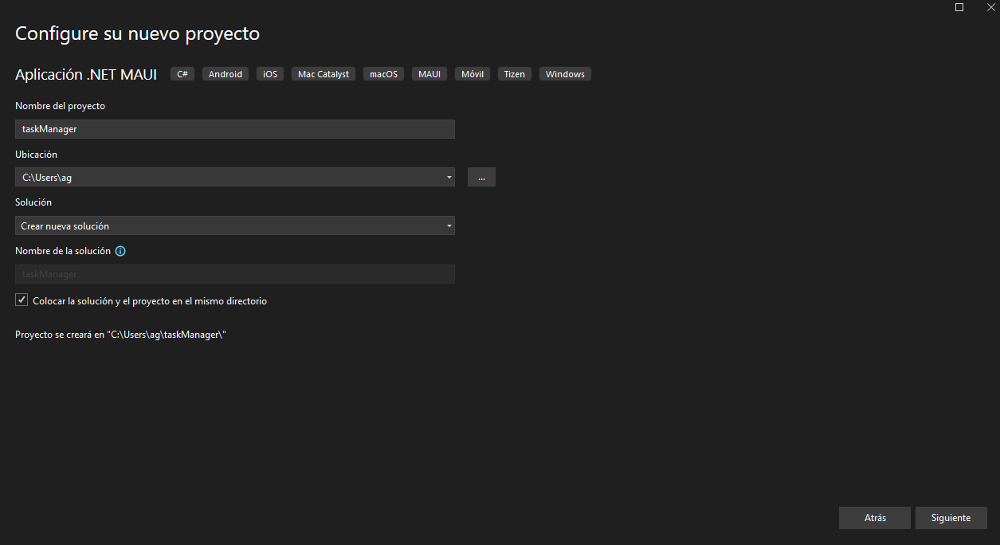

# Workshop .NET MAUI 2025: Aplicación de Gestor de Tareas

## Introducción.
En este tutorial, aprenderás a construir una aplicación de gestor de tareas en .NET MAUI desde cero. La aplicación permitirá agregar, editar y borrar tareas, y utilizará SQLite para el almacenamiento local. Este tutorial está diseñado para llevarte de la mano, paso a paso, con explicaciones teóricas y consejos prácticos.

## Requisitos Previos.
- Visual Studio 2022 o superior  
- .NET 6.0 o superior  
- MAUI Installed
- Conocimientos básicos de C# y XAML  
- SQlite-Net-PCL comando: `dotnet add package sqlite-net-pcl

## Estructura del Proyecto

- **/Platforms**: Contiene el código específico de cada plataforma (Android, iOS, Windows, etc.).
- **/Resources**: Contiene recursos como imágenes, fuentes y archivos de diseño.
- **/Views**: Contiene las vistas de la aplicación.
- **/ViewModels**: Contiene los modelos de vista de la aplicación.
- **/Models**: Contiene las clases de modelo de datos.
- **/Converters**: Contiene los convertidores de datos.

## Paso 1: Configuración del Proyecto.
1. Crear un nuevo proyecto MAUI:
   - Abre Visual Studio y selecciona "Crear un nuevo proyecto".
   - Elige "Aplicación .NET MAUI" y dale un nombre a tu proyecto, por ejemplo, `GestorDeTareas`.
   - Configura el entorno asegurándote de tener instaladas las herramientas necesarias para MAUI.





### Creamos las carpetas de esteuctura de proyecto en caso de no existir.
- Crear las carpetas `Views`, `ViewModels`, `Models` y `Converters` en la raíz del proyecto.
- Estas carpetas se utilizarán para organizar las vistas, modelos de vista, modelos de datos y convertidores de datos de la aplicación.

### Dentro de ViewModels creamos los archivos `BaseViewModel.cs` y `MainPageViewModel.cs`.
- `BaseViewModel.cs`: Clase base para los modelos de vista de la aplicación.
- `MainPageViewModel.cs`: Modelo de vista para la página principal de la aplicación.

---

## Paso 2: Crear la Interfaz de Usuario (UI)
1. Diseñar la pantalla principal:
   - Vamos a utilizar un `CollectionView` para mostrar la lista de tareas.
   - CollectionView: Es un control flexible y eficiente para mostrar listas de datos en MAUI.
   - Border: Permite agregar bordes, esquinas redondeadas a los elementos, y demas propiedades.
   - Abre el archivo `MainPage.xaml` y sigue los pasos listados.


### Añadir las etiquetas basicas.

```xml
<ContentPage xmlns="http://schemas.microsoft.com/dotnet/2021/maui"
             xmlns:x="http://schemas.microsoft.com/winfx/2009/xaml"
             x:Class="gestorTareasaMaui.Views.MainPage"
             xmlns:viewModels="clr-namespace:gestorTareasaMaui.ViewModels"   //Agregamos el namespace de los viewModels
             BackgroundColor="{AppThemeBinding Light={StaticResource BackgroundColorLight}, Dark={StaticResource BackgroundColorDark}}">
```

### Agregar el ViewModel a la página.

```xml
    <ContentPage.BindingContext>
        <viewModels:MainPageViewModel /> //Agregamos el ViewModel a la pagina
    </ContentPage.BindingContext>
```

### Agregar SctollVioew y StackLayout.
- ScrollView: Permite desplazarse por la pantalla si el contenido es más grande que la pantalla.
- StackLayout: Permite apilar elementos verticalmentE o horizontalmente.
- Padding: Espacio alrededor del contenido. (Entre elementos y bordes)

```xml
<ScrollView>
    <StackLayout Padding="10" BackgroundColor="White">
```

### Agregar un Label con el título de la aplicación (Podemos agregar algunas propiedades).

```xml
<Label Text="Mi Primer Gestor de Tareas" FontSize="22" HorizontalOptions="Center" TextColor="Purple" />
```

### Agregar un Picker para filtrar las tareas por estado. (Pendiente, Proceso, Completada))
- Picker: Permite al usuario seleccionar una opción de una lista.
- Title: Texto que se muestra cuando no se ha seleccionado ninguna opción.
- SelectedItem: Propiedad que almacena la opción seleccionada.
- Items: Lista de opciones que se muestran en el Picker.

```xml
<Picker Title="Filtrar por"  SelectedItem="{Binding EstadoFiltro}">
    <Picker.Items>
        <x:String>Mostrar Todo</x:String>
        <x:String>Pendiente</x:String>
        <x:String>Proceso</x:String>
        <x:String>Completada</x:String>
    </Picker.Items>
</Picker>
-
```

### Agregar un CollectionView para mostrar las tareas.
- ItemTemplate: Define la plantilla de cada elemento de la colección.
- DataTemplate: Define la plantilla de datos para cada elemento.
- SwipeView: Permite agregar acciones deslizables a los elementos de la lista.
- SwipeItems: Define los elementos deslizables (Editar y Borrar).
- SwipeItem: Define un elemento deslizable con un texto y un color de fondo.
- LeftItems: Elementos deslizables a la izquierda.

```xml
<CollectionView x:Name="TareasCollectionView" BackgroundColor="White" ItemsSource="{Binding TareasList}"> //Agregamos el nombre de la coleccion y el binding
    <CollectionView.ItemTemplate>
        <DataTemplate>
            <SwipeView>
                <SwipeView.LeftItems>
                    <SwipeItems>
                        <SwipeItem Text="Borrar" BackgroundColor="Red" Command="{Binding BindingContext.OnBorrarTareaCommand, Source={RelativeSource AncestorType={x:Type ContentPage}}}" CommandParameter="{Binding .}" />
                    </SwipeItems>
                </SwipeView.LeftItems>
                <SwipeView.RightItems>
                    <SwipeItems>
                        <SwipeItem Text="Borrar" BackgroundColor="Red" Command="{Binding BindingContext.OnBorrarTareaCommand, Source={RelativeSource AncestorType={x:Type ContentPage}}}" CommandParameter="{Binding .}"" />
                    </SwipeItems>
                </SwipeView.RightItems>
                       
                    <!-- Aqui se agregan los elementos de la tarea a mostrar (Información) -->


                            
            </SwipeView>
        </DataTemplate>
    </CollectionView.ItemTemplate>
</CollectionView>
    <!-- Aqui se agrega el boton para agregar tareas -->
```

### Mostrar Informacion de la Tarea.
- Border: Permite agregar bordes y esquinas redondeadas a los elementos.
- StackLayout: Permite apilar elementos verticalmente.
- Label: Muestra texto en la pantalla.
- Binding: Enlaza los datos de la tarea a los elementos de la interfaz de usuario.
- Converter: Convierte el estado de la tarea en un color para mostrarlo en la interfaz.

```xml
<Border Stroke="LightGray" StrokeThickness="1" Padding="10" Margin="5">
    <StackLayout>
        <Label Text="{Binding nombre}" FontSize="18" FontAttributes="Bold" />
        <Label Text="{Binding descripcion}" FontSize="14" />
        <Label Text="{Binding estado}" FontSize="12" TextColor="{Binding estado, Converter={StaticResource EstadoColorConverter}}" /> //Agregamos el converter para el color del estado
    </StackLayout>
</Border>
```

### Agregar un botón para agregar tareas.
- Button: Permite al usuario interactuar con la aplicación.
- Clicked: Evento que se dispara cuando se hace clic en el botón.
- OnAgregarTareaClicked: Método que se ejecuta cuando se hace clic en el botón.
- Text: Texto que se muestra en el botón.

```xml
<Button Text="Agregar Tarea" Command="{Binding OnAgregarTareaCommand}" /> //Agregamos el comando para agregar tarea
```

### Cerrar las etiquetas de StackLayout, ScrollView y ContentPage.

```xml
    </StackLayout>
</ScrollView>
</ContentPage>
```

### Codigo Completo de `MainPage.xaml`:

```xml
<ContentPage xmlns="http://schemas.microsoft.com/dotnet/2021/maui"
             xmlns:x="http://schemas.microsoft.com/winfx/2009/xaml"
             x:Class="gestorTareasaMaui.Views.MainPage"
             xmlns:viewModels="clr-namespace:gestorTareasaMaui.ViewModels"  
             BackgroundColor="{AppThemeBinding Light={StaticResource BackgroundColorLight}, Dark={StaticResource BackgroundColorDark}}">

    <ContentPage.BindingContext>
        <viewModels:MainPageViewModel />
    </ContentPage.BindingContext>

    <ScrollView>
        <StackLayout Padding="10" BackgroundColor="White">
            <Label Text="Mi Primer Gestor de Tareas" FontSize="22" HorizontalOptions="Center" TextColor="Purple" />

            <Picker Title="Filtrar por"  SelectedItem="{Binding EstadoFiltro}">
                <Picker.Items>
                    <x:String>Mostrar Todo</x:String>
                    <x:String>Pendiente</x:String>
                    <x:String>Proceso</x:String>
                    <x:String>Completada</x:String>
                </Picker.Items>
            </Picker>

            <CollectionView ItemsSource="{Binding TareasList}" >
                <CollectionView.ItemTemplate>
                    <DataTemplate>
                        <SwipeView>
                            <SwipeView.LeftItems>
                                <SwipeItems>
                                    <SwipeItem Text="Editar" BackgroundColor="Blue" Command="{Binding BindingContext.OnEditarTareaCommand, Source={RelativeSource AncestorType={x:Type ContentPage}}}" CommandParameter="{Binding .}" />
                                </SwipeItems>
                            </SwipeView.LeftItems>
                            <SwipeView.RightItems>
                                <SwipeItems>
                                    <SwipeItem Text="Borrar" BackgroundColor="Red" Command="{Binding BindingContext.OnBorrarTareaCommand, Source={RelativeSource AncestorType={x:Type ContentPage}}}" CommandParameter="{Binding .}" />
                                </SwipeItems>
                            </SwipeView.RightItems>
                            <Border Stroke="LightGray" StrokeThickness="1" Padding="10" Margin="5">
                                <StackLayout>
                                    <Label Text="{Binding nombre}" FontSize="18" FontAttributes="Bold" />
                                    <Label Text="{Binding descripcion}" FontSize="14" />
                                    <Label Text="{Binding estado}" FontSize="12" TextColor="{Binding estado, Converter={StaticResource EstadoColorConverter}}" />
                                </StackLayout>
                            </Border>
                        </SwipeView>
                    </DataTemplate>
                </CollectionView.ItemTemplate>
            </CollectionView>

            <Button Text="Agregar Tarea" Command="{Binding OnAgregarTareaCommand}" />
        </StackLayout>
    </ScrollView>
</ContentPage>
```

## Paso 3: Crear el Modelo de Datos
1. Definir la clase `Tarea`:
   - Crea una carpeta llamada `Models` en la raíz del proyecto.
   - Dentro de la carpeta `Models`, crea una clase llamada `Tarea.cs`.
   - Esta clase representará el modelo de datos para las tareas.


```csharp
using SQLite;
using System;
using System.Collections.Generic;
using System.Linq;
using System.Text;
using System.Threading.Tasks;

namespace gestorTareasaMaui.Models
{
    public class tarea
    {
        [PrimaryKey, AutoIncrement]
        //Modelo de datos de la tarea que necesitamos
        public int id { get; set; }
        public string nombre { get; set; }
        public string descripcion { get; set; }
        public string estado { get; set; }
      
    }
}
```

## Paso 4: Crear dentro de ViewModels los archivos `BaseViewModel.cs` y modificarlo.
- `BaseViewModel.cs`: Clase base para los modelos de vista de la aplicación.
- En una aplicación MVVM, la clase BaseViewModel generalmente se usa como la clase base para otros ViewModels que se encargan de la lógica de la interfaz de usuario.
- Se hereda para que puedas aprovechar las funcionalidades de INotifyPropertyChanged y OnPropertyChanged.
- Propiedades: Implementa la interfaz `INotifyPropertyChanged` para notificar a las vistas cuando las propiedades cambian.
- Métodos: `OnPropertyChanged` y `SetProperty` para notificar los cambios de propiedad.
- `OnPropertyChanged`: Notifica a las vistas que una propiedad ha cambiado.
- `SetProperty`: Establece un valor en una propiedad y notifica a las vistas si el valor cambia.
- `CallerMemberName`: Atributo que pasa automáticamente el nombre de la propiedad que llamó al método.

```csharp
using System.ComponentModel; // Importa el espacio de nombres necesario para la interfaz INotifyPropertyChanged
using System.Runtime.CompilerServices; // Para usar el atributo CallerMemberName

namespace gestorTareasaMaui.ViewModels
{
    // La clase BaseViewModel implementa INotifyPropertyChanged, lo que permite a las vistas escuchar y reaccionar a los cambios de propiedad en los ViewModels.
    public class BaseViewModel : INotifyPropertyChanged
    {
        // Evento que se dispara cuando una propiedad cambia
        public event PropertyChangedEventHandler PropertyChanged;

        // Método que invoca el evento PropertyChanged para notificar que una propiedad ha cambiado.
        // Se usa el atributo CallerMemberName para pasar automáticamente el nombre de la propiedad que llamó a este método.
        protected void OnPropertyChanged([CallerMemberName] string propertyName = "")
        {
            // Si hay suscriptores al evento PropertyChanged, se les notifica con el nombre de la propiedad que cambió.
            PropertyChanged?.Invoke(this, new PropertyChangedEventArgs(propertyName));
        }

        // Método genérico que establece un valor en una propiedad y dispara el evento PropertyChanged si el valor realmente cambia.
        // La propiedad pasada por referencia `backingStore` almacena el valor actual.
        protected bool SetProperty<T>(ref T backingStore, T value, [CallerMemberName] string propertyName = "")
        {
            // Si el valor nuevo es igual al valor actual, no hace nada y retorna false
            if (EqualityComparer<T>.Default.Equals(backingStore, value))
                return false;

            // Si el valor ha cambiado, lo asigna al backing store y notifica el cambio de propiedad.
            backingStore = value;
            OnPropertyChanged(propertyName); // Notifica que la propiedad ha cambiado
            return true; // Indica que la propiedad fue cambiada
        }
    }
}
```

### Paso 5: Crear `database.cs` en la raíz del proyecto.
- Esta clase manejará la conexión a la base de datos y las operaciones CRUD.
- SQL lite es una base de datos relacional que se utiliza para almacenar datos localmente en aplicaciones móviles.
- Utiliza métodos asincrónicos para interactuar con la base de datos.
- Utiliza `CreateTableAsync` para crear la tabla de tareas en la base de datos.
- Utiliza `ToListAsync`, `InsertAsync`, `UpdateAsync` y `DeleteAsync` para realizar operaciones en la base de datos.
- dotnet add package sqlite-net-pcl

```csharp
using gestorTareasaMaui.Models;
using SQLite;
using System;
using System.Collections.Generic;
using System.Linq;
using System.Text;
using System.Threading.Tasks;


//Creando clase de base de datos:
namespace gestorTareasaMaui
{
     public class database
    {
        //Creando conexion a la base de datos:
        private readonly SQLiteAsyncConnection _database;

 
        public database(string dbPath)
        {
            _database = new SQLiteAsyncConnection(dbPath);
            _database.CreateTableAsync<tarea>().Wait();
        }

        //Metodo para obtener todas las tareas de la base de datos:
        public Task<List<tarea>> GetTareasAsync()
        {
            return _database.Table<tarea>().ToListAsync();
        }

        //Metdo para guardar tarea en la base de datos:
        public Task<int> SaveTareaAsync(tarea tarea)
        {
            if (tarea.id != 0)
            {
                return _database.UpdateAsync(tarea);
            }
            else
            {
                return _database.InsertAsync(tarea);
            }
        }

        //Metodo para eliminar tarea de la base de datos:
        public Task<int> DeleteTareaAsync(tarea tarea)
        {
            return _database.DeleteAsync(tarea);
        }
    }
}
```

## Paso 6: Manejar la Lógica de Negocio en el ViewModel 
- Editar el archivo en la carpera `ViewModels` llamado `MainPageViewModel.cs`.
- Este archivo contendrá la lógica de negocio para la página principal de la aplicación.
- Hereda de `BaseViewModel` para aprovechar las funcionalidades de `INotifyPropertyChanged`.
- Agregar propiedades y métodos para manejar las tareas.
- Utilizar comandos para agregar, editar y borrar tareas.
- Utilizar métodos asincrónicos para interactuar con la base de datos.


### Declaracion de las propiedades y comandos en `MainPageViewModel.cs`.
- Crea una colección observable de tareas llamada `_tareasList` (Se actuliza automaticamente cuando cambien sus elementos).
- Llama al método `LoadTareas` para cargar las tareas al iniciar la aplicación.
- Crea un comando `OnAgregarTareaCommand` para agregar una nueva tarea.
- Crea un comando `OnBorrarTareaCommand` para borrar una tarea.
- Crea un comando `OnEditarTareaCommand` para editar una tarea.

```csharp
using System.Collections.ObjectModel;
using System.Linq;
using System.Windows.Input;
using gestorTareasaMaui.Models;
using gestorTareasaMaui;

namespace gestorTareasaMaui.ViewModels
{
    public class MainPageViewModel : BaseViewModel
    {
        private ObservableCollection<tarea> _tareasList;
        private string _estadoFiltro;
        private ICommand _onAgregarTareaCommand;
        private ICommand _onEditarTareaCommand;
        private ICommand _onBorrarTareaCommand;

        // Constructor
        public MainPageViewModel()
        {
            _tareasList = new ObservableCollection<tarea>();
            LoadTareas(); // Cargar las tareas inicialmente
        }
```

### Propiedades TareaList y EstadoFiltro en `MainPageViewModel.cs`.
- Crea una propiedad `TareasList` para la colección observable de tareas.
- Crear na propiedad `EstadoFiltro` para filtrar las tareas según su estado.
 
```csharp
// Propiedad que representa la lista de tareas
public ObservableCollection<tarea> TareasList
{
    get => _tareasList;
    set => SetProperty(ref _tareasList, value);
}

// Propiedad para manejar el estado de filtro
public string EstadoFiltro
{
    get => _estadoFiltro;
    set
    {
        SetProperty(ref _estadoFiltro, value);
        LoadTareas(value); // Recargar las tareas cuando se cambia el filtro
    }
}
```

### Comando para Agregar Tarea, Editar y Borrar  en `MainPageViewModel.cs` (Definidos en el paso 2).
- Crea un comando `OnAgregarTareaCommand` para agregar una nueva tarea.
- Crea un comando `OnBorrarTareaCommand` para borrar una tarea.
- Crea un comando `OnEditarTareaCommand` para editar una tarea.

```csharp
// Comando para agregar una nueva tarea
public ICommand OnAgregarTareaCommand => _onAgregarTareaCommand ??= new Command(OnAgregarTarea);
// Comando para borrar una tarea
public ICommand OnBorrarTareaCommand => _onBorrarTareaCommand ??= new Command(OnEditarTarea);
// Comando para editar una tarea
public ICommand OnEditarTareaCommand => _onEditarTareaCommand ??= new Command(OnBorrarTarea);
```

### Crear el método para cargar las tareas de la base de datos 'LoadTareas' en `MainPageViewModel.cs`.
- Utiliza el método `GetTareasAsync` de la base de datos para obtener todas las tareas.
- Limpia la lista de tareas y agrega las tareas obtenidas a la colección observable.
- Utiliza `await` y `async` para realizar operaciones asincrónicas.
- Utiliza un bucle `foreach` para recorrer las tareas y agregarlas a la colección.

```csharp
private async void LoadTareas(string estadoFiltro = null)
{
    var tareas = await App.Database.GetTareasAsync(); // Obtener todas las tareas de la base de datos

    // Filtrar las tareas si se proporciona un filtro de estado
    if (!string.IsNullOrEmpty(estadoFiltro) && estadoFiltro != "Mostrar Todo")
    {
        tareas = tareas.Where(t => t.estado == estadoFiltro).ToList();
    }

    TareasList.Clear(); // Limpiar la lista antes de agregar las tareas filtradas

    // Agregar las tareas filtradas a la lista
    foreach (var tarea in tareas)
    {
        TareasList.Add(tarea);
        Console.WriteLine($"Tarea agregada: {tarea.nombre}, {tarea.descripcion}, {tarea.estado}"); //Probar que nuestra tarea se ese insertando correctamente.
    }
}
```

### Crear el método para agregar una nueva tarea 'OnAgregarTarea' en `MainPageViewModel.cs`.
- DisplayActionSheet: Presenta opciones para elegir algo y DisplayPromptAsync: Muestra cuadros de entrada de texto.
- Utiliza `DisplayPromptAsync` para mostrar cuadros de entrada de texto.
- Crea una nueva tarea con los datos ingresados por el usuario.
- Guarda la tarea en la base de datos utilizando el método `SaveTareaAsync`.
- Agrega la tarea a la colección observable y recarga la lista de tareas.
- Utiliza `DisplayActionSheet` para mostrar opciones de estado.
-
```csharp
private async void OnAgregarTarea()
{
    string nombre = await App.Current.MainPage.DisplayPromptAsync("Nombre", "Ingrese el nombre de la tarea");
    string descripcion = await App.Current.MainPage.DisplayPromptAsync("Descripcion", "Ingrese la descripcion de la tarea");
    string estado = await App.Current.MainPage.DisplayActionSheet("Estado", "Cancelar", null, "Pendiente", "Proceso", "Completada");

    if (!string.IsNullOrEmpty(nombre) && !string.IsNullOrEmpty(descripcion))
    {
        var nuevaTarea = new tarea
        {
            nombre = nombre,
            descripcion = descripcion,
            estado = estado
        };

        await App.Database.SaveTareaAsync(nuevaTarea);
        TareasList.Add(nuevaTarea);
        await App.Current.MainPage.DisplayAlert("Tarea Agregada", "La tarea se ha agregado correctamente", "OK");
    }
}
```

### Crear el metoodo para editar una Tarea 'OnEditarTarea' en `MainPageViewModel.cs`.
- Utiliza el evento `OnEditarTareaCommand` para editar una tarea.

```csharp
private async void OnEditarTarea(tarea tarea)
{
    string nuevoNombre = await App.Current.MainPage.DisplayPromptAsync("Editar Tarea", "Nombre de la tarea:", initialValue: tarea.nombre);
    string nuevaDescripcion = await App.Current.MainPage.DisplayPromptAsync("Editar Tarea", "Descripción de la tarea:", initialValue: tarea.descripcion);
    string nuevoEstado = await App.Current.MainPage.DisplayActionSheet("Estado", "Cancelar", null, "Pendiente", "Proceso", "Completada");

    if (!string.IsNullOrEmpty(nuevoNombre) && !string.IsNullOrEmpty(nuevaDescripcion))
    {
        tarea.nombre = nuevoNombre;
        tarea.descripcion = nuevaDescripcion;
        tarea.estado = nuevoEstado;

        await App.Database.SaveTareaAsync(tarea);
        LoadTareas();  // Recargar la lista de tareas
    }
}
```

### Crear el método para borrar una tarea 'OnBorrarTarea' en `MainPageViewModel.cs`.
- Utiliza el evento `OnBorrarTareaCommand` para borrar una tarea.

```csharp
private async void OnBorrarTarea(tarea tarea)
{
    await App.Database.DeleteTareaAsync(tarea);
    TareasList.Remove(tarea);  // Eliminar la tarea de la lista
    await App.Current.MainPage.DisplayAlert("Tarea Eliminada", "La tarea se ha eliminado correctamente", "OK");
}
```

### Código Completo de `MainPageViewModel.cs`:
```csharp
using System.Collections.ObjectModel;
using System.Linq;
using System.Windows.Input;
using gestorTareasaMaui.Models;
using gestorTareasaMaui;

namespace gestorTareasaMaui.ViewModels
{
    public class MainPageViewModel : BaseViewModel
    {
        private ObservableCollection<tarea> _tareasList;
        private string _estadoFiltro;
        private ICommand _onAgregarTareaCommand;
        private ICommand _onEditarTareaCommand;
        private ICommand _onBorrarTareaCommand;

        public MainPageViewModel()
        {
            _tareasList = new ObservableCollection<tarea>();
            LoadTareas();
        }

        public ObservableCollection<tarea> TareasList
        {
            get => _tareasList;
            set => SetProperty(ref _tareasList, value);
        }

      public string EstadoFiltro
        {
            get => _estadoFiltro;
            set
            {
                SetProperty(ref _estadoFiltro, value);
                LoadTareas(value);
            }
        }

        public ICommand OnAgregarTareaCommand => _onAgregarTareaCommand ??= new Command(OnAgregarTarea);
        public ICommand OnEditarTareaCommand => _onEditarTareaCommand ??= new Command<tarea>(OnEditarTarea);
        public ICommand OnBorrarTareaCommand => _onBorrarTareaCommand ??= new Command<tarea>(OnBorrarTarea);

        private async void LoadTareas(string estadoFiltro = null)
        {
            var tareas = await App.Database.GetTareasAsync();

            if (!string.IsNullOrEmpty(estadoFiltro) && estadoFiltro != "Mostrar Todo")
            {
                tareas = tareas.Where(t => t.estado == estadoFiltro).ToList();
            }

            TareasList.Clear();
            foreach (var tarea in tareas)
            {
                TareasList.Add(tarea);
                Console.WriteLine($"Tarea agregada: {tarea.nombre}, {tarea.descripcion}, {tarea.estado}");

            }
        }

        private async void OnAgregarTarea()
        {
            string nombre = await App.Current.MainPage.DisplayPromptAsync("Nombre", "Ingrese el nombre de la tarea");
            string descripcion = await App.Current.MainPage.DisplayPromptAsync("Descripcion", "Ingrese la descripcion de la tarea");
            string estado = await App.Current.MainPage.DisplayActionSheet("Estado", "Cancelar", null, "Pendiente", "Proceso", "Completada");

            if (!string.IsNullOrEmpty(nombre) && !string.IsNullOrEmpty(descripcion))
            {
                var nuevaTarea = new tarea
                {
                    nombre = nombre,
                    descripcion = descripcion,
                    estado = estado
                };

                await App.Database.SaveTareaAsync(nuevaTarea);
                TareasList.Add(nuevaTarea);
                await App.Current.MainPage.DisplayAlert("Tarea Agregada", "La tarea se ha agregado correctamente", "OK");
            }
        }

        private async void OnEditarTarea(tarea tarea)
        {
            string nuevoNombre = await App.Current.MainPage.DisplayPromptAsync("Editar Tarea", "Nombre de la tarea:", initialValue: tarea.nombre);
            string nuevaDescripcion = await App.Current.MainPage.DisplayPromptAsync("Editar Tarea", "Descripción de la tarea:", initialValue: tarea.descripcion);
            string nuevoEstado = await App.Current.MainPage.DisplayActionSheet("Estado", "Cancelar", null, "Pendiente", "Proceso", "Completada");

            if (!string.IsNullOrEmpty(nuevoNombre) && !string.IsNullOrEmpty(nuevaDescripcion))
            {
                tarea.nombre = nuevoNombre;
                tarea.descripcion = nuevaDescripcion;
                tarea.estado = nuevoEstado;

                await App.Database.SaveTareaAsync(tarea);
                LoadTareas();  // Recargar la lista de tareas
            }
        }

        private async void OnBorrarTarea(tarea tarea)
        {
            await App.Database.DeleteTareaAsync(tarea);
            TareasList.Remove(tarea);  // Eliminar la tarea de la lista
            await App.Current.MainPage.DisplayAlert("Tarea Eliminada", "La tarea se ha eliminado correctamente", "OK");
        }
    }
}
```

### Paso 7: Crear convertidor de colores para el estado de la tare en `EstadoColorConverter.cs`.
- Crear una carpeta llamada `Converters` en la raíz del proyecto.
- Dentro de la carpeta `Converters`, crear una clase llamada `EstadoColorConverter.cs`.
- Un Converter es una clase que implementa la interfaz `IValueConverter` y convierte un valor en otro.
- puede ser utilizado para convertir el estado de la tarea en un color para mostrarlo en la interfaz o para convertir un valor en otro como por ejemplo un valor booleano en un color o un valor numérico en un texto.

```csharp
using System;
using System.Collections.Generic;
using System.Globalization;
using System.Linq;
using System.Text;
using System.Threading.Tasks;
using Microsoft.Maui.Controls;


namespace gestorTareasaMaui.Converters
{   public class EstadoColorConverter : IValueConverter
    {
        public object Convert(object value, Type targetType, object parameter, CultureInfo culture)
        {
            string estado = value as string;

            switch (estado)
            {
                case "Pendiente":
                    return Color.FromArgb("#FF0000"); // Rojo para tareas Pendientes
                case "Proceso":
                    return Color.FromArgb("#000080");  // Amarillo para tareas en Proceso
                case "Completada":
                    return Color.FromArgb("#008000");  // Verde para tareas Completadas
                default:
                    return Color.FromArgb("#808080");  // Gris para cualquier otro caso
            }
        }

        public object ConvertBack(object value, Type targetType, object parameter, CultureInfo culture)
        {
            throw new NotImplementedException();
        }
    }
}
```

### En el archivo `App.xaml` agregar el converter, este es un paso importante para que el converter este disponible en toda la aplicación.
- Agregar el namespace `xmlns:converters` y la referencia al converter en `Application.Resources`.

```xml
<!-- xmlns:Converters="clr-namespace:gestorTareasaMaui.Converters"
 <Converters:EstadoColorConverter x:Key="EstadoColorConverter" /> -->

 <Application xmlns="http://schemas.microsoft.com/dotnet/2021/maui"
             xmlns:x="http://schemas.microsoft.com/winfx/2009/xaml"
             xmlns:local="clr-namespace:gestorTareasaMaui"
             xmlns:Converters="clr-namespace:gestorTareasaMaui.Converters" //Agregamos el namespace de los convertidores
             x:Class="gestorTareasaMaui.App">
    <Application.Resources>
        <ResourceDictionary>
            <ResourceDictionary.MergedDictionaries>
                <ResourceDictionary Source="Resources/Styles/Colors.xaml" />
                <ResourceDictionary Source="Resources/Styles/Styles.xaml" />
            </ResourceDictionary.MergedDictionaries>

            <Converters:EstadoColorConverter x:Key="EstadoColorConverter" /> //Agregamos el converter, es decir su referencia.

            <Color x:Key="BackgroundColorLight">White</Color>
            <Color x:Key="BackgroundColorDark">Black</Color>
            <Style TargetType="ContentPage">
                <Setter Property="BackgroundColor" Value="{AppThemeBinding Light={StaticResource BackgroundColorLight}, Dark={StaticResource BackgroundColorDark}}" />
            </Style>
        </ResourceDictionary>
    </Application.Resources>
</Application>

```


## Paso 8: AppShell.xaml

```xml
<?xml version="1.0" encoding="UTF-8" ?>
<Shell
    x:Class="gestorTareasaMaui.AppShell"
    xmlns="http://schemas.microsoft.com/dotnet/2021/maui"
    xmlns:x="http://schemas.microsoft.com/winfx/2009/xaml"
    xmlns:views="clr-namespace:gestorTareasaMaui.Views"
    Shell.FlyoutBehavior="Flyout"
    Title="gestorTareasaMaui">

    <!-- Página Home -->
    <ShellContent
        Title="Home"
        ContentTemplate="{DataTemplate views:MainPage}"
        Route="MainPage" />
</Shell>

```

---

## Paso 9: Probar la Aplicación
1. Ejecutar la aplicación:
   - Ejecuta la aplicación en un emulador Android o dispositivo físico.
   - Verifica que las tareas se guardan y persisten en la base de datos.
   - Prueba las funcionalidades de agregar, editar y borrar tareas.


---

## Paso 10 (Opcional): Agregar una Página de Perfil al Menú de Navegación


### 1. Crear la Página `UserPage.xaml`
- En Views, crea una nueva página llamada `UserPage.xaml`.
- Agrega un diseño sencillo para mostrar la información del usuario.
- No olvides agregar los bindings necesarios para mostrar los datos del usuario. (Nombre, Correo, etc.)

### 2. Definiendo los namespaces en `UserPage.xaml`.

```xml
<ContentPage xmlns="http://schemas.microsoft.com/dotnet/2021/maui"
xmlns:x="http://schemas.microsoft.com/winfx/2009/xaml"
x:Class="gestorTareasaMaui.Views.UserPage"
xmlns:viewModels="clr-namespace:gestorTareasaMaui.ViewModels" 
BackgroundColor="White"
Title="Profile">
```

### 3. Vincular el Binding Context.

```xml
<ContentPage.BindingContext>
    <viewModels:UserPageViewModel />
</ContentPage.BindingContext>
```

### 4. Vertical StackLayout para la Página de Perfil Y Border para la Imagen del Usuario (robot.png).

```xml
<VerticalStackLayout Padding="15" Spacing="15" VerticalOptions="StartAndExpand">

    <Border Stroke="White" StrokeThickness="3" Background="White"
            WidthRequest="120" HeightRequest="120" StrokeShape="Ellipse"
            HorizontalOptions="Center">
        <Image Source="robot.png" WidthRequest="150" HeightRequest="150"/>
    </Border>
```

### 5. Tarjeta de infomracion de usuario.
- Usamos un Border para crear una tarjeta de información del usuario.
- Agregamos un Grid para organizar la información en filas y columnas.
- Definimos las filas y columnas del Grid.

```xml
<Border BackgroundColor="White" StrokeThickness="10" StrokeShape="RoundRectangle 15"
        Padding="20" Margin="5">
    <Grid RowSpacing="15">
        <Grid.RowDefinitions>
            <RowDefinition Height="Auto"/>
            <RowDefinition Height="Auto"/>
            <RowDefinition Height="Auto"/>
            <RowDefinition Height="Auto"/>
        </Grid.RowDefinitions>

        <Grid.ColumnDefinitions>
            <ColumnDefinition Width="Auto"/>
            <ColumnDefinition Width="*"/>
        </Grid.ColumnDefinitions>

        <!-- Contenido de las celdas de la tabla -->


    </Grid>
</Border>
```

### 6. Contenido de la información del usuario.
- Agrega etiquetas para mostrar el nombre, el nombre de usuario, el correo electrónico y la ubicación del usuario.
- Utiliza el binding para mostrar los datos del usuario.

```xml
<Label Text="Name:" FontAttributes="Bold" TextColor="#6A0DAD" Grid.Row="0" Grid.Column="0"/>
<Label Text="{Binding Nombre}" FontSize="14" TextColor="Black" Grid.Row="0" Grid.Column="1"/>

<Label Text="Username: " FontAttributes="Bold" TextColor="#6A0DAD" Grid.Row="1" Grid.Column="0"/>
<Label Text="{Binding Username}" FontSize="14" TextColor="Black" Grid.Row="1" Grid.Column="1"/>

<Label Text="Email: " FontAttributes="Bold" TextColor="#6A0DAD" Grid.Row="2" Grid.Column="0"/>
<Label Text="{Binding Correo}" FontSize="14" TextColor="Black" Grid.Row="2" Grid.Column="1"/>

<Label Text="Location: " FontAttributes="Bold" TextColor="#6A0DAD" Grid.Row="3" Grid.Column="0"/>
<Label Text="{Binding Location}" FontSize="14" TextColor="Black" Grid.Row="3" Grid.Column="1"/> 
```

### 7.Boton edición (opcional)

```xml
<Button Text="Editar Perfil"
BackgroundColor="#6A0DAD"
TextColor="White"
CornerRadius="20"
FontAttributes="Bold"
WidthRequest="200"
HorizontalOptions="Center"/>
</VerticalStackLayout>
</ContentPage>
```

### 8. Codigo completo de `UserPage.xaml`:
```xml
<?xml version="1.0" encoding="utf-8" ?>
<ContentPage xmlns="http://schemas.microsoft.com/dotnet/2021/maui"
             xmlns:x="http://schemas.microsoft.com/winfx/2009/xaml"
             x:Class="gestorTareasaMaui.Views.UserPage"
             xmlns:viewModels="clr-namespace:gestorTareasaMaui.ViewModels" 
             BackgroundColor="White"
             Title="Profile">

    <!-- View Model Context, For Bidings. -->
    <ContentPage.BindingContext>
        <viewModels:UserPageViewModel />
    </ContentPage.BindingContext>

    <VerticalStackLayout Padding="15" Spacing="15" VerticalOptions="StartAndExpand">

        <!-- Avatar Redondeado -->
        <Border Stroke="White" StrokeThickness="3" Background="White"
                WidthRequest="120" HeightRequest="120" StrokeShape="Ellipse"
                HorizontalOptions="Center">
            <Image Source="robot.png" WidthRequest="150" HeightRequest="150"/>
        </Border>

        <!-- Tarjeta de Información -->
        <Border BackgroundColor="White" StrokeThickness="10" StrokeShape="RoundRectangle 15"
                Padding="20" Margin="5">
            <Grid RowSpacing="15">
                <Grid.RowDefinitions>
                    <RowDefinition Height="Auto"/>
                    <RowDefinition Height="Auto"/>
                    <RowDefinition Height="Auto"/>
                    <RowDefinition Height="Auto"/>
                </Grid.RowDefinitions>

                <Grid.ColumnDefinitions>
                    <ColumnDefinition Width="Auto"/>
                    <ColumnDefinition Width="*"/>
                </Grid.ColumnDefinitions>

                <Label Text="Name:" FontAttributes="Bold" TextColor="#6A0DAD" Grid.Row="0" Grid.Column="0"/>
                <Label Text="{Binding Nombre}" FontSize="14" TextColor="Black" Grid.Row="0" Grid.Column="1"/>

                <Label Text="Username: " FontAttributes="Bold" TextColor="#6A0DAD" Grid.Row="1" Grid.Column="0"/>
                <Label Text="{Binding Username}" FontSize="14" TextColor="Black" Grid.Row="1" Grid.Column="1"/>

                <Label Text="Email: " FontAttributes="Bold" TextColor="#6A0DAD" Grid.Row="2" Grid.Column="0"/>
                <Label Text="{Binding Correo}" FontSize="14" TextColor="Black" Grid.Row="2" Grid.Column="1"/>

                <Label Text="Location: " FontAttributes="Bold" TextColor="#6A0DAD" Grid.Row="3" Grid.Column="0"/>
                <Label Text="{Binding Location}" FontSize="14" TextColor="Black" Grid.Row="3" Grid.Column="1"/>
            </Grid>
        </Border>

        <!-- Botón de edición -->
        <Button Text="Editar Perfil"
                BackgroundColor="#6A0DAD"
                TextColor="White"
                CornerRadius="20"
                FontAttributes="Bold"
                WidthRequest="200"
                HorizontalOptions="Center"/>
    </VerticalStackLayout>
    
</ContentPage>
```


### 9. Creamos UserPageViewModel.cs en la carpeta ViewModels.
- Creamos una clase `UserPageViewModel` que hereda de `BaseViewModel`.
- Agregamos propiedades para el nombre, el nombre de usuario, el correo electrónico y la ubicación del usuario.
- Inicializamos las propiedades con valores de ejemplo.
- Estos valores se mostrarán en la página de perfil del usuario.

```csharp
using System.Windows.Input;
using gestorTareasaMaui.Models;

namespace gestorTareasaMaui.ViewModels
{
    public class UserPageViewModel : BaseViewModel
    {
        private string _nombre;
        private string _correo;
        private string _location;
        private string _username;
        public UserPageViewModel()
        {
            // Cargar los datos del usuario al iniciar
            CargarDatosUsuario();
        }

        // Nombre que se mostrarán en la UI View.
        public string Nombre
        {
            get => _nombre;
            set => SetProperty(ref _nombre, value);
        }

        // Username que se mostrará en la UI View.
        public string Username
        {
            get => _username;
            set => SetProperty(ref _username, value);
        }

        // Correo que se mostrará en la UI View.
        public string Correo
        {
            get => _correo;
            set => SetProperty(ref _correo, value);
        }

        public string Location
        {
            get => _location;
            set => SetProperty(ref _location, value);
        }


        // Método para cargar los datos del usuario
        private void CargarDatosUsuario()
        {
            // Aquí deberíamos cargar los datos del usuario desde una fuente de datos,
            // por ejemplo, desde la base de datos o un servicio.
            // Para este ejemplo, usaremos valores predeterminados.
            Nombre = "Maui Microsoft Workshop 2025";
            Correo = "maui.the.best@microsoft.com";
            Username = "mauimicrosoft2025";
            Location = "Ciudad de México";
        }
    }
}
```


### 10. Agregar el ítem de navegación en `AppShell.xaml`

Abre el archivo `AppShell.xaml` y modifícalo para incluir la nueva página de perfil:

```xml
<?xml version="1.0" encoding="UTF-8" ?>
<Shell
    x:Class="gestorTareasaMaui.AppShell"
    xmlns="http://schemas.microsoft.com/dotnet/2021/maui"
    xmlns:x="http://schemas.microsoft.com/winfx/2009/xaml"
    xmlns:views="clr-namespace:gestorTareasaMaui.Views"
    Shell.FlyoutBehavior="Flyout"
    Title="gestorTareasaMaui">

    <!-- Página Home -->
    <ShellContent
        Title="Home"
        ContentTemplate="{DataTemplate views:MainPage}"
        Route="MainPage" />

    <!--Nueva página de perfil (Descomentada cuando sea necesario)-->
    <ShellContent
        Title="Perfil"
        ContentTemplate="{DataTemplate views:UserPage}"
        Route="UserPage"/>

</Shell>
```

### Ejecutar la Aplicación**
- Prueba la aplicación y verifica que el nuevo ítem de perfil se muestra en el menú de navegación. 
- Puedes personalizar la página de perfil y agregar más información según tus necesidades.

---

## Contribución

Si deseas contribuir a este proyecto, por favor sigue los siguientes pasos:

1. Haz un fork del repositorio.
2. Crea una nueva rama (`git checkout -b feature/nueva-funcionalidad`).
3. Realiza tus cambios y haz commit (`git commit -am 'Añadir nueva funcionalidad'`).
4. Sube tus cambios a tu fork (`git push origin feature/nueva-funcionalidad`).
5. Abre un Pull Request.

## Licencia

Este proyecto está licenciado bajo la Licencia MIT. Consulta el archivo LICENSE para más detalles.