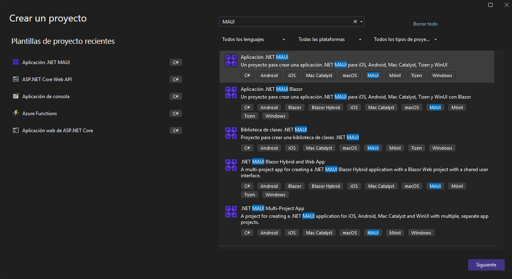
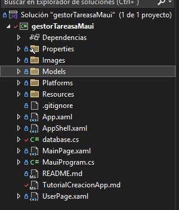

# Tutorial Paso a Paso para Construir una Aplicación de Gestor de Tareas en .NET MAUI

## Introducción.
En este tutorial, aprenderás a construir una aplicación de gestor de tareas en .NET MAUI desde cero. La aplicación permitirá agregar, editar y borrar tareas, y utilizará SQLite para el almacenamiento local. Este tutorial está diseñado para llevarte de la mano, paso a paso, con explicaciones teóricas y consejos prácticos.

## Requisitos Previos.
- Visual Studio 2022 o superior  
- .NET 6.0 o superior  
- MAUI Installed
- Conocimientos básicos de C# y XAML  
- SQlite-Net-PCL comando: `dotnet add package sqlite-net-pcl

## Estructura del Proyecto

- **/Platforms**: Contiene el código específico de cada plataforma (Android, iOS, Windows, etc.).
- **/Resources**: Contiene recursos como imágenes, fuentes y archivos de diseño.
- **/Views**: Contiene las vistas de la aplicación.
- **/Models**: Contiene las clases de modelo de datos.

## Paso 1: Configuración del Proyecto.
1. Crear un nuevo proyecto MAUI:
   - Abre Visual Studio y selecciona "Crear un nuevo proyecto".
   - Elige "Aplicación .NET MAUI" y dale un nombre a tu proyecto, por ejemplo, `GestorDeTareas`.
   - Configura el entorno asegurándote de tener instaladas las herramientas necesarias para MAUI.





## Paso 2: Crear la Interfaz de Usuario (UI)
1. Diseñar la pantalla principal:
   - Vamos a utilizar un `CollectionView` para mostrar la lista de tareas.
   - CollectionView: Es un control flexible y eficiente para mostrar listas de datos en MAUI.
   - Border: Permite agregar bordes, esquinas redondeadas a los elementos, y demas propiedades.
   - Abre el archivo `MainPage.xaml` y sigue los pasos listados.


### Añadir las etiquetas basicas.

```xml
<ContentPage xmlns="http://schemas.microsoft.com/dotnet/2021/maui"
             xmlns:x="http://schemas.microsoft.com/winfx/2009/xaml"
             x:Class="gestorTareasaMaui.MainPage"
             BackgroundColor="{AppThemeBinding Light={StaticResource BackgroundColorLight}, Dark={StaticResource BackgroundColorDark}}">
```

### Establece el fondo de la pagina (Ya se encuentra dentro de ContentPage).

```xml
BackgroundColor="{AppThemeBinding Light={StaticResource BackgroundColorLight}, Dark={StaticResource BackgroundColorDark}}"
```

### Agregar SctollVioew y StackLayout.
- ScrollView: Permite desplazarse por la pantalla si el contenido es más grande que la pantalla.
- StackLayout: Permite apilar elementos verticalmentE o horizontalmente.
- Padding: Espacio alrededor del contenido. (Entre elementos y bordes)

```xml
<ScrollView>
    <StackLayout Padding="10" BackgroundColor="White">
```

### Agregar un Label con el título de la aplicación (Podemos agregar algunas propiedades).

```xml
<Label Text="Mi Primer Gestor de Tareas" FontSize="22" HorizontalOptions="Center" TextColor="Purple" />
```

### Agregar un CollectionView para mostrar las tareas.
- ItemTemplate: Define la plantilla de cada elemento de la colección.
- DataTemplate: Define la plantilla de datos para cada elemento.
- SwipeView: Permite agregar acciones deslizables a los elementos de la lista.
- SwipeItems: Define los elementos deslizables (Editar y Borrar).

```xml
  <CollectionView x:Name="TareasCollectionView" BackgroundColor="White">
                <CollectionView.ItemTemplate>
                    <DataTemplate>
                        <SwipeView>
                            <SwipeView.LeftItems>
                                <SwipeItems>
                                    <SwipeItem Text="Editar" BackgroundColor="Blue" Invoked="OnEditarTareaCommand" CommandParameter="{Binding .}" />
                                </SwipeItems>
                            </SwipeView.LeftItems>
                            <SwipeView.RightItems>
                                <SwipeItems>
                                    <SwipeItem Text="Borrar" BackgroundColor="Red"  Invoked="OnBorrarTareaCommand"  CommandParameter="{Binding .}" />
                                </SwipeItems>
                            </SwipeView.RightItems>
                       
                               <!-- Aqui se agregan los elementos de la tarea a mostrar (Información) -->


                            
                        </SwipeView>
                    </DataTemplate>
                </CollectionView.ItemTemplate>
            </CollectionView>
                <!-- Aqui se agrega el boton para agregar tareas -->
```

### Mostrar Informacion de la Tarea.
- Border: Permite agregar bordes y esquinas redondeadas a los elementos.
- StackLayout: Permite apilar elementos verticalmente.
- Label: Muestra texto en la pantalla.
- Binding: Enlaza los datos de la tarea a los elementos de la interfaz de usuario.

```xml
<Border Stroke="LightGray" StrokeThickness="1" Padding="10" Margin="5">
    <StackLayout>
        <Label Text="{Binding nombre}" FontSize="18" FontAttributes="Bold" />
        <Label Text="{Binding descripcion}" FontSize="14" />
        <Label Text="{Binding estado}" FontSize="12" TextColor="Green" />
    </StackLayout>
</Border>
```

### Agregar un botón para agregar tareas.
- Button: Permite al usuario interactuar con la aplicación.
- Clicked: Evento que se dispara cuando se hace clic en el botón.
- OnAgregarTareaClicked: Método que se ejecuta cuando se hace clic en el botón.
- Text: Texto que se muestra en el botón.

```xml
<Button Text="Agregar Tarea" Clicked="OnAgregarTareaClicked" />
```

### Cerrar las etiquetas de StackLayout, ScrollView y ContentPage.

```xml
    </StackLayout>
</ScrollView>
</ContentPage>
```

### Codigo Completo de `MainPage.xaml`:

```xml
<ContentPage xmlns="http://schemas.microsoft.com/dotnet/2021/maui"
             xmlns:x="http://schemas.microsoft.com/winfx/2009/xaml"
             x:Class="gestorTareasaMaui.MainPage"
              BackgroundColor="{AppThemeBinding Light={StaticResource BackgroundColorLight}, Dark={StaticResource BackgroundColorDark}}">
    <ScrollView>
        <StackLayout Padding="10" BackgroundColor="White">
            <Label Text="Mi Primer Gestor de Tareas" FontSize="22" HorizontalOptions="Center" TextColor="Purple" />
            <CollectionView x:Name="TareasCollectionView" BackgroundColor="White">
                <CollectionView.ItemTemplate>
                    <DataTemplate>
                        <SwipeView>
                            <SwipeView.LeftItems>
                                <SwipeItems>
                                    <SwipeItem Text="Editar" BackgroundColor="Blue" Invoked="OnEditarTareaCommand" CommandParameter="{Binding .}" />
                                </SwipeItems>
                            </SwipeView.LeftItems>
                            <SwipeView.RightItems>
                                <SwipeItems>
                                    <SwipeItem Text="Borrar" BackgroundColor="Red"  Invoked="OnBorrarTareaCommand"  CommandParameter="{Binding .}" />
                                </SwipeItems>
                            </SwipeView.RightItems>
                            <Border Stroke="LightGray" StrokeThickness="1" Padding="10" Margin="5">
                                <StackLayout>
                                    <Label Text="{Binding nombre}" FontSize="18" FontAttributes="Bold" />
                                    <Label Text="{Binding descripcion}" FontSize="14" />
                                    <Label Text="{Binding estado}" FontSize="12" TextColor="Green" />
                                </StackLayout>
                            </Border>
                        </SwipeView>
                    </DataTemplate>
                </CollectionView.ItemTemplate>
            </CollectionView>
            <Button Text="Agregar Tarea" Clicked="OnAgregarTareaClicked" />
        </StackLayout>
    </ScrollView>
</ContentPage>
```

## Paso 3: Crear el Modelo de Datos
1. Definir la clase `Tarea`:
   - Crea una carpeta llamada `Models` en la raíz del proyecto.
   - Dentro de la carpeta `Models`, crea una clase llamada `Tarea.cs`.
   - Esta clase representará el modelo de datos para las tareas.



```csharp
using SQLite;

public class tarea
{
    [PrimaryKey, AutoIncrement]
    public int Id { get; set; }
    public string nombre { get; set; }
    public string descripcion { get; set; }
    public string estado { get; set; }
}
```

## Paso 4: Manejar la Lógica de Negocio
- Editar el archivo `MainPage.xaml.cs` para agregar la lógica de negocio.
- Agregar métodos para cargar, agregar, editar y borrar tareas.
- Utilizar `ObservableCollection` para notificar a la UI cuando hay cambios en la lista.
- Utilizar métodos de la base de datos para guardar, actualizar y eliminar tareas.
- Recargar la lista de tareas después de realizar cambios.
- Asegúrate de que la clase `MainPage` herede de `ContentPage`.


### Inicializar la colección de tareas.
- Crea una colección observable de tareas llamada `tareasList`.
- En el constructor de la página, inicializa la colección y asigna la lista de tareas al `CollectionView`.
- Llama al método `LoadTareas` para cargar las tareas al iniciar la aplicación.
```csharp
using System.Collections.ObjectModel;
using System.Threading.Tasks;
using System.Windows.Input;


public MainPage()
{
   
    InitializeComponent();
    tareasList = new ObservableCollection<tarea> ();
    TareasCollectionView.ItemsSource = tareasList;
    LoadTareas();
}
```

### Crear el método para cargar las tareas de la base de datos 'LoadTareas'.
- Utiliza el método `GetTareasAsync` de la base de datos para obtener todas las tareas.
- Limpia la lista de tareas y agrega las tareas obtenidas a la colección observable.
- Utiliza `await` y `async` para realizar operaciones asincrónicas.
- Utiliza un bucle `foreach` para recorrer las tareas y agregarlas a la colección.

```csharp
private async void LoadTareas()
{
    var tareas = await App.Database.GetTareasAsync();
    tareasList.Clear();
    foreach (var tarea in tareas)
    {
        tareasList.Add(tarea);
    }
}
```

### Crear el método para agregar una nueva tarea 'OnAgregarTareaClicked'.
- DisplayActionSheet: Presenta opciones para elegir algo y DisplayPromptAsync: Muestra cuadros de entrada de texto.
- Utiliza `DisplayPromptAsync` para mostrar cuadros de entrada de texto.
- Crea una nueva tarea con los datos ingresados por el usuario.
- Guarda la tarea en la base de datos utilizando el método `SaveTareaAsync`.
- Agrega la tarea a la colección observable y recarga la lista de tareas.
- Utiliza `DisplayActionSheet` para mostrar opciones de estado.

```csharp
private async void OnAgregarTareaClicked(object sender, EventArgs e)
{
    string nombre = await DisplayPromptAsync("Nombre", "Ingrese el nombre de la tarea");
    string descripcion = await DisplayPromptAsync("Descripcion", "Ingrese la descripcion de la tarea");
    string estado = await DisplayActionSheet("Estado", "Cancelar", null, "Pendiente", "En Proceso", "Completada");

    if (!string.IsNullOrEmpty(nombre) && !string.IsNullOrEmpty(descripcion))
    {
        tarea nuevaTarea = new tarea()
        {
            nombre = nombre,
            descripcion = descripcion,
            estado = estado
        };

        //Guardar la tarea en la base de datos
        await App.Database.SaveTareaAsync(nuevaTarea);
        tareasList.Add(nuevaTarea);
    }
}
```

### Crear el metodo para borrar una tarea de la lista y de la base de datos.
- Utiliza el evento `OnBorrarTareaCommand` para borrar una tarea.
- Utiliza el método `DeleteTareaAsync` de la base de datos para eliminar la tarea.
- Elimina la tarea de la colección observable.

```csharp
private async void OnBorrarTareaCommand(object sender, EventArgs e)
{
    var swipeItem = sender as SwipeItem;
    var tarea = swipeItem?.CommandParameter as tarea;
    if (tarea != null)
    {
        await App.Database.DeleteTareaAsync(tarea);
        tareasList.Remove(tarea); // Eliminar la tarea de la colección observable
    }
}
```

### Crear el método para editar una tarea de la lista y de la base de datos.
- Utiliza el evento `OnEditarTareaCommand` para editar una tarea.
- Utiliza el método `SaveTareaAsync` de la base de datos para actualizar la tarea.
- Recarga la lista de tareas después de editar una tarea.

```csharp
private async void OnEditarTareaCommand(object sender, EventArgs e)
{
    var swipeItem = sender as SwipeItem;
    var tarea = swipeItem?.CommandParameter as tarea;

    if (tarea != null)
    {
        string nuevoNombre = await DisplayPromptAsync("Editar Tarea", "Nombre de la tarea:", initialValue: tarea.nombre);
        string nuevaDescripcion = await DisplayPromptAsync("Editar Tarea", "Descripción de la tarea:", initialValue: tarea.descripcion);
        string nuevoEstado = await DisplayActionSheet("Estado", "Cancelar", null, "Pendiente", "En Proceso", "Completada");

        if (!string.IsNullOrEmpty(nuevoNombre) && !string.IsNullOrEmpty(nuevaDescripcion))
        {
            tarea.nombre = nuevoNombre;
            tarea.descripcion = nuevaDescripcion;
            tarea.estado = nuevoEstado;

            // Actualizar la tarea en la base de datos
            await App.Database.SaveTareaAsync(tarea);

            // Recargar la lista de tareas
            LoadTareas();
        }
    }
}
```

### Código Completo de `MainPage.xaml.cs`:

```csharp
using System.Collections.ObjectModel;
using System.Threading.Tasks;
using System.Windows.Input;

namespace gestorTareasaMaui
{
    public partial class MainPage : ContentPage
    {
        
        
        private ObservableCollection<tarea> tareasList;


        public MainPage()
        {
   
            InitializeComponent();
            tareasList = new ObservableCollection<tarea> ();
            TareasCollectionView.ItemsSource = tareasList;
            LoadTareas();
        }

        
        //Metodo para cargar las tareas de la base de datos que ya persisten.
        private async void LoadTareas()
        {
            var tareas = await App.Database.GetTareasAsync();
            tareasList.Clear();
            foreach (var tarea in tareas)
            {
                tareasList.Add(tarea);
            }
        }

        private async void OnAgregarTareaClicked(object sender, EventArgs e)
        {

            string nombre = await DisplayPromptAsync("Nombre", "Ingrese el nombre de la tarea");    
            string descripcion = await DisplayPromptAsync("Descripcion", "Ingrese la descripcion de la tarea");
            string estado = await DisplayActionSheet("Estado", "Cancelar", null, "Pendiente", "En Proceso", "Completada");

            if (!string.IsNullOrEmpty(nombre) && !string.IsNullOrEmpty(descripcion))
            {
                tarea nuevaTarea = new tarea()
                {
                    nombre = nombre,
                    descripcion = descripcion,
                    estado = estado
                };

                //Guardar la tarea en la base de datos
                await App.Database.SaveTareaAsync(nuevaTarea);

                tareasList.Add(nuevaTarea);
                //TareasListView.ItemsSource = null;
                //TareasListView.ItemsSource = tareasList;
               // LoadTareas();
            }

        }

        //Borrando tarea de la Lista y de la base de datos
        private async void OnBorrarTareaCommand(object sender, EventArgs e)
        {
            var swipeItem = sender as SwipeItem;
            var tarea = swipeItem?.CommandParameter as tarea;

            if (tarea != null)
            {
                await App.Database.DeleteTareaAsync(tarea);
                tareasList.Remove(tarea); // Eliminar la tarea de la colección observable
            }
        }

        // Editando tarea de la Lista y de la base de datos
        private async void OnEditarTareaCommand(object sender, EventArgs e)
        {
            var swipeItem = sender as SwipeItem;
            var tarea = swipeItem?.CommandParameter as tarea;

            if (tarea != null)
            {
                string nuevoNombre = await DisplayPromptAsync("Editar Tarea", "Nombre de la tarea:", initialValue: tarea.nombre);
                string nuevaDescripcion = await DisplayPromptAsync("Editar Tarea", "Descripción de la tarea:", initialValue: tarea.descripcion);
                string nuevoEstado = await DisplayActionSheet("Estado", "Cancelar", null, "Pendiente", "En Proceso", "Completada");

                if (!string.IsNullOrEmpty(nuevoNombre) && !string.IsNullOrEmpty(nuevaDescripcion))
                {
                    tarea.nombre = nuevoNombre;
                    tarea.descripcion = nuevaDescripcion;
                    tarea.estado = nuevoEstado;

                    // Actualizar la tarea en la base de datos
                    await App.Database.SaveTareaAsync(tarea);

                    // Recargar la lista de tareas
                    LoadTareas();
                }
            }
        }

    }

}
```

## Paso 5: Implementar Almacenamiento Local con SQLite
1. Instalar el paquete NuGet `sqlite-net-pcl`:

```sh
dotnet add package sqlite-net-pcl
```

- Crear la clase `database.cs` en la raíz del proyecto.
- Esta clase manejará la conexión a la base de datos y las operaciones CRUD.
- SQL lite es una base de datos relacional que se utiliza para almacenar datos localmente en aplicaciones móviles.
- Utiliza métodos asincrónicos para interactuar con la base de datos.
- Utiliza `CreateTableAsync` para crear la tabla de tareas en la base de datos.
- Utiliza `ToListAsync`, `InsertAsync`, `UpdateAsync` y `DeleteAsync` para realizar operaciones en la base de datos.


```csharp
using SQLite;
using System;
using System.Collections.Generic;
using System.Linq;
using System.Text;
using System.Threading.Tasks;


//Creando clase de base de datos:
namespace gestorTareasaMaui
{
     public class database
    {
        //Creando conexion a la base de datos:
        private readonly SQLiteAsyncConnection _database;

 
        public database(string dbPath)
        {
            _database = new SQLiteAsyncConnection(dbPath);
            _database.CreateTableAsync<tarea>().Wait();
        }

        //Metodo para obtener todas las tareas de la base de datos:
        public Task<List<tarea>> GetTareasAsync()
        {
            return _database.Table<tarea>().ToListAsync();
        }

        //Metdo para guardar tarea en la base de datos:
        public Task<int> SaveTareaAsync(tarea tarea)
        {
            if (tarea.id != 0)
            {
                return _database.UpdateAsync(tarea);
            }
            else
            {
                return _database.InsertAsync(tarea);
            }
        }

        //Metodo para eliminar tarea de la base de datos:
        public Task<int> DeleteTareaAsync(tarea tarea)
        {
            return _database.DeleteAsync(tarea);
        }
    }
}
```

## Paso 6: Probar la Aplicación
1. Ejecutar la aplicación:
   - Ejecuta la aplicación en un emulador Android o dispositivo físico.
   - Verifica que las tareas se guardan y persisten en la base de datos.
   - Prueba las funcionalidades de agregar, editar y borrar tareas.


## Paso 7: Agregar Picker para seleccionar el estado de la tarea.
- Agregar un Picker para seleccionar el estado de la tarea.
- Utilizar `Picker` para mostrar una lista de opciones y permitir al usuario seleccionar una.
- Agregar opciones de estado a la lista del Picker.

### Agregar Picker al formulario de agregar tarea MainPage.xaml.
- Agregar entre el Titulo del label y el CollectionView.
- Agregar Picker con opciones de estado: Pendiente, En Proceso, Completada o Mostrar Todo.
```xml
<!-- Picker para seleccionar el estado -->
<Picker x:Name="EstadoPicker" Title="Filtrar por Estado" SelectedIndexChanged="OnEstadoChanged">
    <Picker.Items>
        <x:String>Mostrar Todo</x:String>
        <x:String>Pendiente</x:String>
        <x:String>En Proceso</x:String>
        <x:String>Completada</x:String>
    </Picker.Items>
</Picker>
```

### Manejar el evento SelectedIndexChanged del Picker en MainPage.xaml.cs.
- Crear el método `OnEstadoChanged` para filtrar las tareas por estado.
- Utilizar el método `LoadTareas` para cargar las tareas según el estado seleccionado.
- Utilizar un switch para filtrar las tareas según el estado seleccionado.

```csharp
 // Método para cargar las tareas desde la base de datos con picker agregado

    private async void LoadTareas(string estadoFiltro = null) //Agregamos Variable dentro del metodo
    {
        var tareas = await App.Database.GetTareasAsync();
        tareasList.Clear();

        //------------  Filtrar tareas si se especifica un estado dentro --------------------------
        if (!string.IsNullOrEmpty(estadoFiltro) && estadoFiltro != "Mostrar Todo")
        {
            tareas = tareas.Where(t => t.estado == estadoFiltro).ToList();
        }

        // Agregar las tareas a la colección
        foreach (var tarea in tareas)
        {
            tareasList.Add(tarea);
        }
    }

    // Evento cuando el usuario cambia el filtro de estado
    private void OnEstadoChanged(object sender, EventArgs e)
    {
        string estadoSeleccionado = EstadoPicker.SelectedItem as string;
        LoadTareas(estadoSeleccionado);  // Cargar las tareas filtradas por estado
    }

```

---

## Paso 8 (Opcional): Agregar una Página de Perfil al Menú de Navegación

En este paso, agregaremos una nueva página **Perfil** al menú de la aplicación utilizando `Shell`.

### **1. Agregar el ítem de navegación en `AppShell.xaml`**

Abre el archivo `AppShell.xaml` y modifícalo para incluir la nueva página de perfil:

```xml
<Shell
    x:Class="gestorTareasaMaui.AppShell"
    xmlns="http://schemas.microsoft.com/dotnet/2021/maui"
    xmlns:x="http://schemas.microsoft.com/winfx/2009/xaml"
    xmlns:local="clr-namespace:gestorTareasaMaui"
    Shell.FlyoutBehavior="Flyout">

    <ShellContent
        Title="Home"
        ContentTemplate="{DataTemplate local:MainPage}"
        Route="MainPage" />

    <ShellContent
        Title="Perfil"
        ContentTemplate="{DataTemplate local:UserPage}"
        Route="UserPage" />
</Shell>
```

### **2. Crear la Página `UserPage.xaml`**

Agrega un nuevo archivo **UserPage.xaml** y copia el siguiente código:

```xml
<?xml version="1.0" encoding="utf-8" ?>
<ContentPage xmlns="http://schemas.microsoft.com/dotnet/2021/maui"
             xmlns:x="http://schemas.microsoft.com/winfx/2009/xaml"
             x:Class="gestorTareasaMaui.UserPage"
             Title="My Profile">

    <ContentPage.Background>
        <LinearGradientBrush>
            <GradientStop Color="#6A0DAD" Offset="0.1"/>
            <GradientStop Color="#9B30FF" Offset="1.0"/>
        </LinearGradientBrush>
    </ContentPage.Background>

    <VerticalStackLayout Padding="30" Spacing="25" VerticalOptions="Center">

        <!-- Avatar Redondeado -->
        <Border Stroke="White" StrokeThickness="3" Background="White"
                WidthRequest="120" HeightRequest="120" StrokeShape="Ellipse"
                HorizontalOptions="Center">
            <Image Source="dotnet_bot.png" WidthRequest="100" HeightRequest="100"/>
        </Border>

        <!-- Tarjeta de Información -->
        <Border BackgroundColor="White" StrokeThickness="0" StrokeShape="RoundRectangle 15"
                Padding="20" Margin="5">
            <Grid RowSpacing="10">
                <Grid.RowDefinitions>
                    <RowDefinition Height="Auto"/>
                    <RowDefinition Height="Auto"/>
                    <RowDefinition Height="Auto"/>
                    <RowDefinition Height="Auto"/>
                </Grid.RowDefinitions>

                <Grid.ColumnDefinitions>
                    <ColumnDefinition Width="Auto"/>
                    <ColumnDefinition Width="*"/>
                </Grid.ColumnDefinitions>

                <Label Text="Name:" FontAttributes="Bold" TextColor="#6A0DAD" Grid.Row="0" Grid.Column="0"/>
                <Label Text="Alex Maui" FontSize="18" TextColor="Black" Grid.Row="0" Grid.Column="1"/>

                <Label Text="Username:" FontAttributes="Bold" TextColor="#6A0DAD" Grid.Row="1" Grid.Column="0"/>
                <Label Text="@agmmauideveloper" FontSize="18" TextColor="Black" Grid.Row="1" Grid.Column="1"/>

                <Label Text="Email:" FontAttributes="Bold" TextColor="#6A0DAD" Grid.Row="2" Grid.Column="0"/>
                <Label Text="alexmaui@email.com" FontSize="18" TextColor="Black" Grid.Row="2" Grid.Column="1"/>

                <Label Text="Location:" FontAttributes="Bold" TextColor="#6A0DAD" Grid.Row="3" Grid.Column="0"/>
                <Label Text="Ciudad de México, MX" FontSize="18" TextColor="Black" Grid.Row="3" Grid.Column="1"/>
            </Grid>
        </Border>

        <!-- Botón de edición -->
        <Button Text="Editar Perfil"
                BackgroundColor="#6A0DAD"
                TextColor="White"
                CornerRadius="20"
                FontAttributes="Bold"
                WidthRequest="200"
                HorizontalOptions="Center"/>
    </VerticalStackLayout>
    
</ContentPage>
```

### **3. Crear el Código `UserPage.xaml.cs`**

Agrega un archivo `UserPage.xaml.cs` y define la clase para la nueva página:

```csharp
namespace gestorTareasaMaui;

public partial class UserPage : ContentPage
{
	public UserPage()
	{
		InitializeComponent();
	}
}
```

### **4. Ejecutar la Aplicación**
Prueba la aplicación y verifica que el nuevo ítem de perfil se muestra en el menú de navegación. Puedes personalizar la página de perfil y agregar más información según tus necesidades.

---

## Contribución

Si deseas contribuir a este proyecto, por favor sigue los siguientes pasos:

1. Haz un fork del repositorio.
2. Crea una nueva rama (`git checkout -b feature/nueva-funcionalidad`).
3. Realiza tus cambios y haz commit (`git commit -am 'Añadir nueva funcionalidad'`).
4. Sube tus cambios a tu fork (`git push origin feature/nueva-funcionalidad`).
5. Abre un Pull Request.

## Licencia

Este proyecto está licenciado bajo la Licencia MIT. Consulta el archivo LICENSE para más detalles.